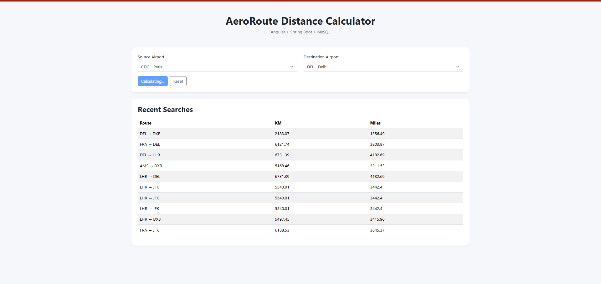
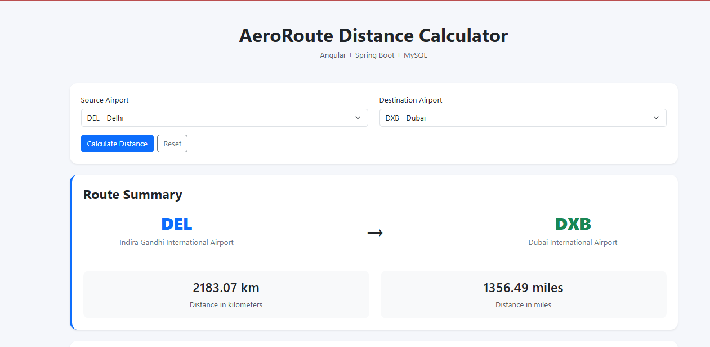
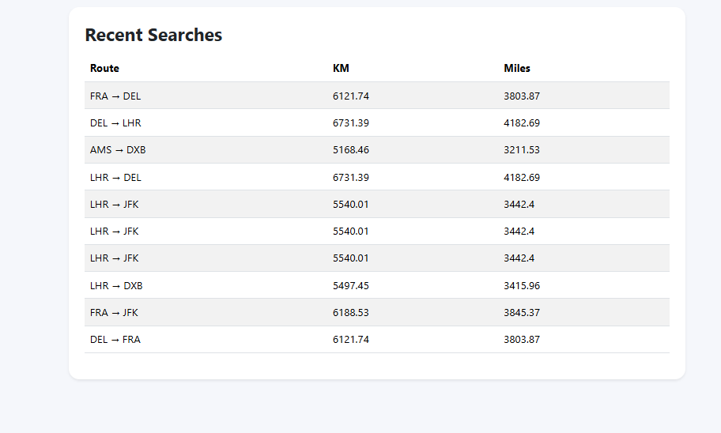

# AeroRoute Distance Calculator

A full-stack airport distance calculator built using Angular, Spring Boot, and MySQL.

This application calculates flight route distances between international airports using the Haversine formula and stores recent searches in a MySQL database.

---

## Features

- Airport-to-airport distance calculation
- Distance in kilometers and miles
- Route summary dashboard
- Recent searches history
- REST API backend
- Angular frontend UI
- MySQL database integration
- Input validation
- Responsive Bootstrap UI

---

## Tech Stack

### Frontend
- Angular
- TypeScript
- Bootstrap

### Backend
- Spring Boot
- Java
- Maven

### Database
- MySQL

---

## Project Structure

```text
aeroroute-distance-calculator/
│
├── backend/
│   └── backend/
│       ├── src/
│       ├── pom.xml
│       └── mvnw
│
├── frontend/
│   ├── src/
│   ├── public/
│   ├── package.json
│   └── angular.json
│
├── database/
│   └── schema.sql
│
├── screenshots/
│   ├── home.png
│   ├── route-summary.png
│   ├── recent-searches.png
│   └── backend-api.png
│
└── README.md

---

## Screenshots

### Home Page



---

### Route Summary



---

### Recent Searches Dashboard



---

### Backend API Response


